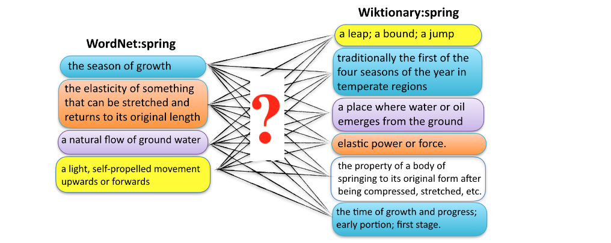

# Multilingual Evaluation Datasets for Monolingual Word Sense Alignment

Monolingual Word Sense alignment (MWSA) is the task of aligning word senses across resources in the same language. A word can be defined in different ways in different resources. Finding out which ones are somehow connected together is the task of word sense alignment. This task was recently the focus of the [1st "Monolingual Word Sense Alignment" Shared Task](https://competitions.codalab.org/competitions/22163).

The current repository contains a set of 17 datasets of manually-annotated senses developed within the [ELEXIS](https://elex.is/) project. These datasets cover 15 languages and are based on expert-made dictionaries along with collaboratively-curated ones, such as Wiktionary. The following table shows the statistics of the datasets by providing the number of senses (number of the words in the definitions are provided in parentheses).

## Data description

<table align="center" class="table table-bordered table-hover table-condensed table-striped">
<thead class="thead-dark">
    <th> Language </th>
    <th> Resource </th>
    <th> Nouns </th>
    <th> Verbs </th>
    <th> Adjectives </th>
    <th> Adverbs </th>
    <th> Other </th>
    <th> All </th>
</thead>

<tbody>
<tr>
	<td rowspan="2">Basque (eu)</td>
	<td> Basque Wordnet </td>
	<td> 929 (6836) </td>
	<td> 0 (0) </td>
	<td> 0 (0) </td>
	<td> 0 (0) </td>
	<td> 0 (0) </td>
	<td> 929 (6836) </td>
</tr>
<tr>
	<td> <i>Euskal Hiztegia</i> </td>
	<td> 971 (7754) </td>
	<td> 0 (0) </td>
	<td> 0 (0) </td>
	<td> 0 (0) </td>
	<td> 0 (0) </td>
	<td> 971 (7754)</td>
</tr>

<tr>
	<td rowspan="2">Bulgarian (bg)</td>
	<td> BTB-WN </td>
	<td> 1394 (15649) </td>
	<td> 175 (1698) </td>
	<td> 305 (3187) </td>
	<td> 50 (338) </td>
	<td> 0 (0) </td>
	<td> 1924 (20872)</td>
</tr>
<tr>
	<td> <a href="https://bg.wiktionary.org/" target="_blank"> Bulgarian Wiktionary </a> </td>
	<td> 1273 (12883) </td>
	<td> 164 (1107) </td>
	<td> 194 (1418) </td>
	<td> 39 (306) </td>
	<td> 0 (0) </td>
	<td> 1670 (15714)</td>
</tr>

<tr>
	<td rowspan="2">Danish (da)</td>
	<td> <a href="https://ordnet.dk/ods" target="_blank"> Ordbog over det danske Sprog </a> </td>
	<td> 2176 (282040) </td>
	<td> 983 (119163) </td>
	<td> 436 (60599) </td>
	<td> 0 (0) </td>
	<td> 0 (0) </td>
	<td> 3595 (461802)</td>
</tr>
<tr>
	<td> <a href="https://ordnet.dk/ddo" target="_blank"> Den Danske Ordbog </a> </td>
	<td> 1036 (12326) </td>
	<td> 383 (4045) </td>
	<td> 248 (2228) </td>
	<td> 0 (0) </td>
	<td> 0 (0) </td>
	<td> 1667 (18599)</td>
</tr>

<tr>
	<td rowspan="2">Dutch (NL)</td>
	<td> <a href="http://gtb.ivdnt.org/search/" target="_blank"> Woordenboek der Nederlandsche Taal </a> </td>
	<td> 1459 (28979) </td>
	<td> 405 (5185) </td>
	<td> 527 (7878) </td>
	<td> 106 (2662) </td>
	<td> 0 (0) </td>
	<td> 2497 (44704)</td>
</tr>
<tr>
	<td> <a href="http://anw.ivdnt.org/search" target="_blank"> Algemeen Nederlands Woordenboek </a> </td>
	<td> 497 (8443) </td>
	<td> 140 (1542) </td>
	<td> 109 (1393) </td>
	<td> 13 (172) </td>
	<td> 0 (0) </td>
	<td> 759 (11550)</td>
</tr>

<tr>
	<td rowspan="2">English (KD) (en)</td>
	<td> <a href="https://www.lexicala.com/resources" target="_blank"> Global </a> </td>
	<td> 92 (532) </td>
	<td> 107 (617) </td>
	<td> 80 (457) </td>
	<td> 57 (257) </td>
	<td> 61 (283) </td>
	<td> 397 (2146)</td>
</tr>
<tr>
	<td> <a href="https://www.lexicala.com/resources" target="_blank"> Password </a> </td>
	<td> 66 (536) </td>
	<td> 72 (417) </td>
	<td> 62 (324) </td>
	<td> 33 (177) </td>
	<td> 46 (188) </td>
	<td> 279 (1642)</td>
</tr>

<tr>
	<td rowspan="2"> English (NUIG) (en)</td>
	<td> <a href="https://www.websters1913.com/" target="_blank"> Webster 1913 </a> </td>
	<td> 1131 (11606) </td>
	<td> 741 (4622) </td>
	<td> 373 (2585) </td>
	<td> 45 (269) </td>
	<td> 0 (0) </td>
	<td> 2290 (19082)</td>
</tr>
<tr>
	<td> <a href="https://wordnet.princeton.edu/" target="_blank"> Princeton WordNet </a> </td>
	<td> 730 (12166) </td>
	<td> 496 (6980) </td>
	<td> 249 (2892) </td>
	<td> 24 (207) </td>
	<td> 0 (0) </td>
	<td> 1499 (22245)</td>
</tr>

<tr>
	<td rowspan="2">Estonian (es)</td>
	<td> <a href="http://www.eki.ee/dict/eks/" target="_blank"> Dictionary of Estonian (EKS) </a> </td>
	<td> 543 (4012) </td>
	<td> 273 (1598) </td>
	<td> 151 (747) </td>
	<td> 98 (451) </td>
	<td> 78 (370) </td>
	<td> 1143 (7178)</td>
</tr>
<tr>
	<td> <a href="http://www.eki.ee/dict/psv/index.cgi?C06=en" target="_blank"> Estonian Basic Dictionary (PSV) </a></td>
	<td> 543 (4492) </td>
	<td> 273 (1983) </td>
	<td> 151 (1097) </td>
	<td> 98 (596) </td>
	<td> 79 (468) </td>
	<td> 1144 (8636)</td>
</tr>

<tr>
	<td rowspan="2">German (de)</td>
	<td> <a href="https://de.wiktionary.org" target="_blank"> German Wiktionary </a> </td>
	<td> 2026 (15160) </td>
	<td> 0 (0) </td>
	<td> 0 (0) </td>
	<td> 0 (0) </td>
	<td> 0 (0) </td>
	<td> 2026 (15160)</td>
</tr>
<tr>
	<td> <a href="http://www.omegawiki.org/Portal:deu" target="_blank"> German OmegaWiki </a></td>
	<td> 1266 (14354) </td>
	<td> 0 (0) </td>
	<td> 0 (0) </td>
	<td> 0 (0) </td>
	<td> 0 (0) </td>
	<td> 1266 (14354)</td>
</tr>

<tr>
	<td rowspan="2">Hungarian (hu)</td>
	<td> <a href="http://mek.oszk.hu/adatbazis/magyar-nyelv-ertelmezo-szotara/elolap.php" target="_blank"> Comprehensive </a> </td>
	<td> X </td>
	<td> X </td>
	<td> X </td>
	<td> X </td>
	<td> X </td>
	<td> 1355 (14654)</td>
</tr>
<tr>
	<td> <a href="http://nagyszotar.nytud.hu/index.html" target="_blank"> Explanatory </a> </td>
	<td> X </td>
	<td> X </td>
	<td> X </td>
	<td> X </td>
	<td> X </td>
	<td> 1038 (10934)</td>
</tr>

<tr>
	<td rowspan="2">Irish (ga)</td>
	<td> <a href="https://www.teanglann.ie/en/fb/" target="_blank"> An Foclóir Beag </a> </td>
	<td> 891 (8053) </td>
	<td> 11 (95) </td>
	<td> 55 (267) </td>
	<td> 10 (56) </td>
	<td> 36 (171) </td>
	<td> 1003 (8642)</td>
</tr>
<tr>
	<td> <a href="https://ga.wiktionary.org" target="_blank"> Irish Wiktionary </a> </td>
	<td> 1209 (6696) </td>
	<td> 8 (45) </td>
	<td> 61 (181) </td>
	<td> 10 (41) </td>
	<td> 36 (109) </td>
	<td> 1324 (7072)</td>
</tr>

<tr>
	<td rowspan="2">Italian (it)</td>
	<td> <a href="http://www.ilc.cnr.it/iwndb_php/"> ItalWordNet </a> </td>
	<td> 408 (3128) </td>
	<td> 352 (2411) </td>
	<td> 0 (0) </td>
	<td> 0 (0) </td>
	<td> 0 (0) </td>
	<td> 760 (5539)</td>
</tr>
<tr>
	<td> SIMPLE </td>
	<td> 290 (1990) </td>
	<td> 218 (1240) </td>
	<td> 0 (0) </td>
	<td> 0 (0) </td>
	<td> 0 (0) </td>
	<td> 508 (3230)</td>
</tr>

<tr>
	<td rowspan="2">Serbian (sr)</td>
	<td> <a href="http://korpus.matf.bg.ac.rs/SrpWN/" target="_blank"> Serbian WordNet </a> </td>
	<td> 691 (5864) </td>
	<td> 985 (6522) </td>
	<td> 92 (713) </td>
	<td> 0 (0) </td>
	<td> 0 (0) </td>
	<td> 1768 (13099)</td>
</tr>
<tr>
	<td> Dictionary of Serbo-Croatian Literary Language </td>
	<td> 289 (2360) </td>
	<td> 281 (1527) </td>
	<td> 29 (215) </td>
	<td> 0 (0) </td>
	<td> 0 (0) </td>
	<td> 599 (4102)</td>
</tr>

<tr>
	<td rowspan="2">Slovenian (JSI) (sl)</td>
	<td> <a href="http://lojze.lugos.si/darja/research/slownet/" target="_blank"> Slovene WordNet </a> </td>
	<td> 409 (1106) </td>
	<td> 303 (901) </td>
	<td> 237 (733) </td>
	<td> 44 (133) </td>
	<td> 0 (0) </td>
	<td> 993 (2873)</td>
</tr>
<tr>
	<td> <a href="http://eng.slovenscina.eu/spletni-slovar/leksikalna-baza" target="_blank"> Slovene Lexical Database </a> </td>
	<td> 284 (2237) </td>
	<td> 191 (1047) </td>
	<td> 220 (1486) </td>
	<td> 29 (102) </td>
	<td> 0 (0) </td>
	<td> 724 (4872)</td>
</tr>

<tr>
	<td rowspan="2">Slovenian (ISJFR) (sl)</td>
	<td> <a href="https://www.clarin.si/repository/xmlui/handle/11356/1249" target="_blank"> Standard Slovenian Dictionary (eSSKJ) </a> </td>
	<td> 229 (2060) </td>
	<td> 109 (911) </td>
	<td> 76 (620) </td>
	<td> 0 (0) </td>
	<td> 60 (588) </td>
	<td> 474 (4179)</td>
</tr>
<tr>
	<td> <a href="https://isjfr.zrc-sazu.si/sl/publikacije/kostelski-slovar#v" target="_blank"> Kostelski slovar </a> </td>
	<td> 151 (1050) </td>
	<td> 61 (308) </td>
	<td> 45 (257) </td>
	<td> 0 (0) </td>
	<td> 38 (263) </td>
	<td> 295 (1878)</td>
</tr>

<tr>
	<td rowspan="2">Spanish (es)</td>
	<td> <a href="Diccionario de la lengua española" target="_blank"> Diccionario de la lengua española </a> </td>
	<td> 617 (7986) </td>
	<td> 225 (2426) </td>
	<td> 305 (3269) </td>
	<td> 26 (161) </td>
	<td> 24 (250) </td>
	<td> 1197 (14092)</td>
</tr>
<tr>
	<td> <a href="https://es.wiktionary.org" target="_blank"> Spanish Wiktionary </a> </td>
	<td> 602 (6421) </td>
	<td> 227 (2045) </td>
	<td> 294 (2825) </td>
	<td> 25 (129) </td>
	<td> 22 (123) </td>
	<td> 1170 (11543)</td>
</tr>

<tr>
	<td rowspan="2">Portuguese (pt-pt)</td>
	<td> <a href="https://pt.wikipedia.org/wiki/Dicion%C3%A1rio_da_L%C3%ADngua_Portuguesa_Contempor%C3%A2nea" target="_blank"> Dicionário da Língua Portuguesa Contemporânea </a> </td>
	<td> 285 (4060) </td>
	<td> 58 (686) </td>
	<td> 110 (1287) </td>
	<td> 9 (143) </td>
	<td> 1 (9) </td>
	<td> 463 (6185)</td>
</tr>
<tr>
	<td> <a href="https://dicionario-aberto.net/" target="_blank"> Dicionário Aberto </a> </td>
	<td> 199 (1521) </td>
	<td> 53 (203) </td>
	<td> 67 (372) </td>
	<td> 3 (15) </td>
	<td> 1 (5) </td>
	<td> 323 (2116)</td>
</tr>

<tr>
	<td rowspan="2">Russian (rs)</td>
	<td> <a href="https://en.wikipedia.org/wiki/Dictionary_of_the_Russian_Language_(Ozhegov)" target="_blank"> Ozhegov-Shvedova </a> </td>
	<td> 258 (2038) </td>
	<td> 109 (615) </td>
	<td> 101 (533) </td>
	<td> 15 (77) </td>
	<td> 44 (368) </td>
	<td> 527 (3631)</td>
</tr>
<tr>
	<td> Dictionary of the Russian Language (MAS) </td>
	<td> 310 (2811) </td>
	<td> 173 (1338) </td>
	<td> 190 (1219) </td>
	<td> 20 (114) </td>
	<td> 71 (1010) </td>
	<td> 764 (6492)</td>
</tr>
</tbody>
</table>

## Conversion to RDF

`json-to-rdf.py` is a simple script that converts the JSON alignments into TSV and then RDF. 

## Reference
If you're using any part of these datasets, please don't forget to cite the following paper:

~~~
@inproceedings{ahmadi2020multilingual,
	title={A Multilingual Evaluation Dataset for Monolingual Word Sense Alignment},
	author="Ahmadi, Sina and McCrae, John P. and Nimb, Sanni and Khan, Fahad and Monachini, Monica and Pedersen, Bolette S. and Declerck, Thierry and Wissik, Tanja and Bellandi, Andrea and Pisani, Irene and Troelsgård, Thomas and Olsen, Sussi and Krek, Simon and Lipp, Veronika and Váradi, Tamás and Simon, László and Győrffy, András and Tiberius, Carole and Schoonheim, Tanneke and Ben Moshe, Yifat and Rudich, Maya and Abu Ahmad, Raya and Lonke, Dorielle and Kovalenko, Kira and Langemets, Margit and Kallas, Jelena and Dereza, Oksana and Fransen, Theodorus and Cillessen, David and Lindemann, David and Alonso, Mikel and Salgado, Ana and Sancho, José Luis and Ureña-Ruiz, Rafael-J. and Simov, Kiril and Osenova, Petya and Kancheva, Zara and Radev, Ivaylo and Stanković, Ranka and Perdih, Andrej and Gabrovšek, Dejan",
	booktitle="Proceedings of the 12th Language Resource and Evaluation Conference (LREC 2020)",
	year={2020},
	date="2020-05-11",
	address= "Marseille, France"
}
~~~

## Licence

This repository is licensed under the [Apache License 2.0](https://raw.githubusercontent.com/elexis-eu/Sense-alignment-datasets/master/LICENSE).

<!--|check bad relation errors in the Spanish and SLZ data when converting to RDF|-->